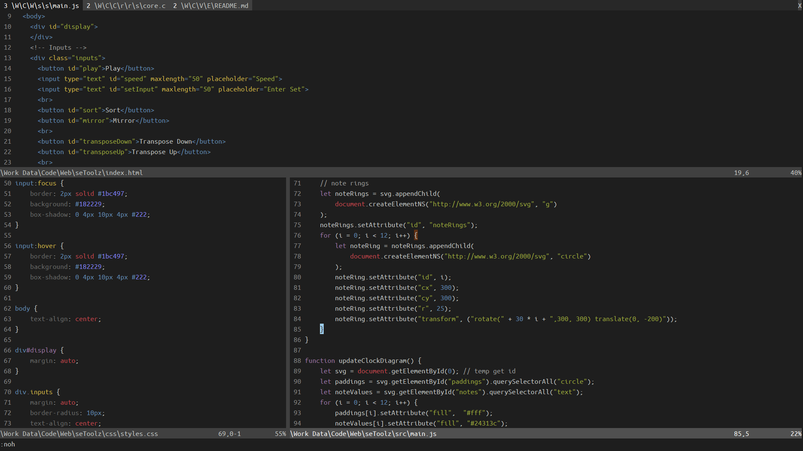
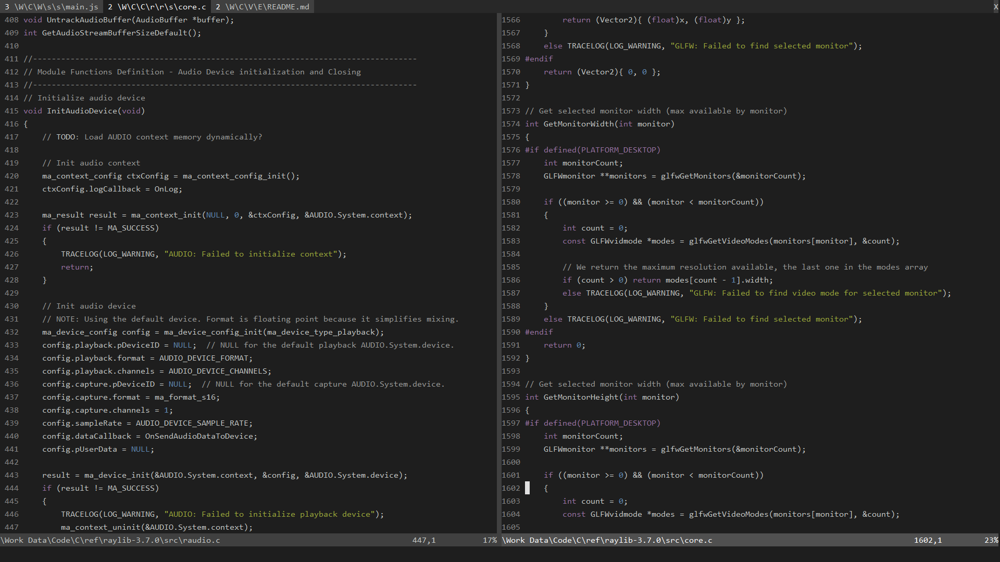
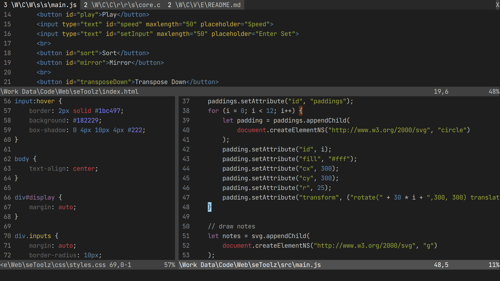
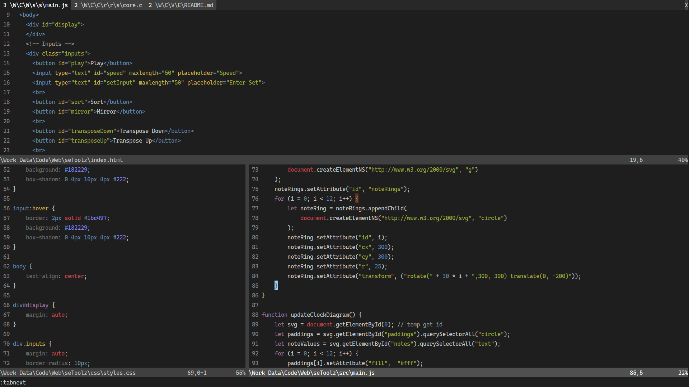
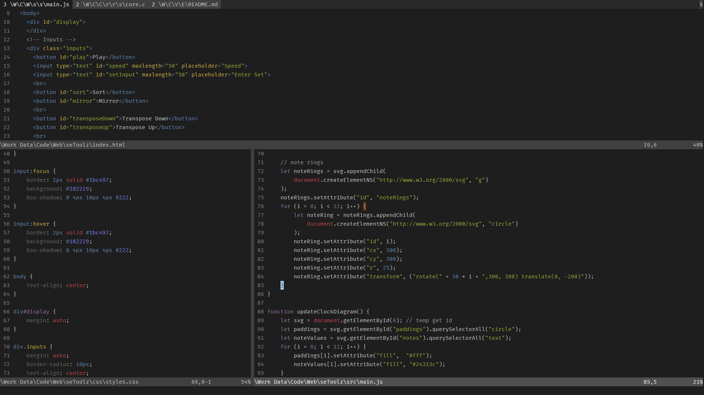

# Monokai Dimmed Colorscheme for Vim

## Introduction

A neutral, low-key colorscheme with just enough contrast.  
Suitable for practical longtime use.

Ported from [Monokai Dimmed]() theme on VS Code with minor adjustments.

## Screenshots

- Writter's personal config, [Ubuntu Mono](), `h:13.5`, `GuiLinespace 6`

- [Consolas](), `h:12`, `GuiLinespace 6`

- [Jetbrains Mono](), `h:18`, `GuiLinespace 6`

- [Cascadia Mono](), `h:12`, `GuiLinespace 6`

- [Fira Mono](), `h:11.5`, `GuiLinespace 6`

## How to Install

It's recommended to use this on Neovim with nvim-qt.

- Neovim/nvim-qt:

    1. Go to where you installed Neovim, and to `/share/nvim/runtime/colors`.

    2. Copy `Monokai-Dimmed.vim` to here.

    3. Open Neovim, run `:colorscheme Monokai-Dimmed`, it should change.  
    If not, back to step 1, check for errors and repeat.

    4. Run `:echo stdpath('config')`, it will output something like:  
    `C:\Users\You\AppData\Local\nvim` (this is on windows)

    5. Go there, create a `nvim` folder if there is none.  
    Create a `ginit.vim` file, add the following lines:
        
        ~~~
        colorscheme Monokai-Dimmed
        GuiTabline 0
        GuiPopupmenu 0
        ~~~
    
        Additionally, you can add something like:

        ~~~
        GuiFont! YourGoodFont:h12
        GuiLinespace 6
        ~~~
    
    6. Reopen Neovim, it should work now.

- Neovim with other frontends:

    - The setup is basically the same, but how they handle GUI settings is probably different.  
    Read your frontend's docs to write GUI settings.

- Vanilla Vim:

    1. Find the `colors` directory of your version of Vim.

    2. Copy `Monokai-Dimmed.vim` to here.

    3. Put `set termguicolors` in your `vimrc`.

    4. Put `colorscheme Monokai-Dimmed` in `vimrc`.  
    This may not work properly, even if you put it in the end of file.  
    You can open Vim and enter `:colorscheme Monokai-Dimmed` again to make it fully working.

    5. It will probably complain about some configs, fix them yourself because different version will have different complains.

## License & Credits

Due to the [ambiguous statement]() from original theme author ([Monokai Dimmed]() on VS Code is also a port),  
and original author of [Monokai]() colorscheme didn't give a license,  
license for this colorscheme cannot be decided, and I'm not sure if this port is proper.

Beware of this if you want to redistribute.
